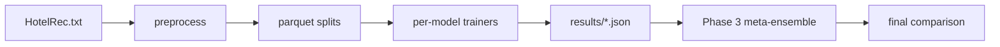

# Codebase Overview

> Comparative study of recommender system approaches on the HotelRec dataset (50M TripAdvisor hotel reviews), built as a three-phase university project (CMPE 256, Spring 2026).

**Last updated:** 2026-08-02
**Primary language:** Python 3.11
**Architecture style:** Shared-foundation monorepo with per-member variant subdirectories

---

## Architecture overview

The project has three phases that map to distinct code layers:

1. **Shared foundation (Phase 1)** under `src/data/`, `src/models/`, `src/evaluation/`, and top-level training scripts. Provides the data pipeline (k-core filtering, train/val/test splits), baseline models (Popularity, ItemKNN, GMF), a uniform evaluation protocol (1-vs-99 leave-one-out with HR@k and NDCG@k), and calibrated RMSE/MAE.

2. **Individual variants (Phase 2)** under `variants/{hriday,aditya,pramod}/`. Each member implements one advanced method with its own notebook, README, and decision log. Models live in `src/models/` (shared namespace) with dedicated training scripts in `src/`.

3. **Integration (Phase 3)** via `src/phase3_meta_ensemble.py`. A LightGBM meta-learner stacks out-of-fold predictions from the four best Phase-2 variants (SASRec, LightGCN-HG, NeuMF-Attn, TextNCF Multi-Task).

All models share the same data splits, evaluation protocol, and RNG seeding, making cross-variant comparisons valid.



---

## Tech stack

| Layer | Technology | Notes |
|---|---|---|
| Runtime | Python 3.11 | `.python-version` pins 3.11; `setup.py` requires >=3.9 |
| Deep learning | PyTorch (CUDA nightly) | RTX 5070 Ti (SM_120) requires nightly cu128 builds |
| Graph library | scipy sparse | `src/graph/hetero_adj.py` builds adjacencies in pure scipy, no torch dependency |
| Text encoding | sentence-transformers (MiniLM-L6) | Frozen 384-dim embeddings, no fine-tuning |
| Meta-ensemble | LightGBM | `LGBMRanker` with lambdarank objective |
| Config | PyYAML | `configs/*.yaml` per model |
| Data format | Parquet | All splits stored as parquet; raw JSONL on disk |
| Package install | `pip install -e .` | Editable install via `setup.py` |

---

## Entry points

All training scripts are invoked as modules from the repo root (`python -m src.<script>`):

| Entry | Command | Purpose |
|---|---|---|
| Preprocessing | `python -m src.data.preprocess --kcore 20` | Raw JSONL -> k-core filtered parquet (two-pass) |
| Splitting | `python -m src.data.split --kcore 20` | 80/10/10 train/val/test split (seed=42) |
| Baselines | `python -m src.run_baselines --kcore 20` | Popularity + ItemKNN |
| GMF | `python -m src.train_gmf --config configs/gmf.yaml --kcore 20` | Neural baseline |
| SASRec | `python -m src.train_sasrec --config configs/sasrec.yaml --kcore 20` | Hriday primary variant |
| LightGCN-HG | `python -m src.train_lightgcn_hg --config configs/lightgcn_hg.yaml --kcore 20` | Hriday secondary; `--tiers none` for vanilla |
| NeuMF-Attn | `python -m src.train_neumf_attn --config configs/neumf_attn.yaml --kcore 20` | Aditya variant |
| TextNCF | `bash scripts/run_text_ncf_all.sh` | Pramod full pipeline (encode + 5 trainings + evals) |
| Text encoding | `python scripts/encode_text.py --kcore 20 --device cuda` | MiniLM review encoding (~11 min) |
| Phase 3 | `python -m src.phase3_meta_ensemble --kcore 20` | LightGBM meta-ensemble (~2 min) |
| RMSE pass | `python scripts/compute_rmse.py --kcore 20 ...` | Rating metrics for all models |

---

## Key modules

| Path | Responsibility |
|---|---|
| `src/data/preprocess.py` | Two-pass k-core filtering over 50M JSONL reviews. Pass 1 counts frequencies; Pass 2 loads survivors. Handles the full 50 GB without OOM. |
| `src/data/split.py` | Random 80/10/10 split with `sklearn.model_selection.train_test_split`, seed=42. |
| `src/data/dataset.py` | `InteractionDataset` (BPR training, on-the-fly neg sampling) and `EvalInteractionDataset` (1-vs-99 eval with pre-sampled negatives). `get_dataloaders()` factory. |
| `src/data/sequential.py` | `NextItemDataset` and `SequentialEvalDataset` for SASRec-style sequence models. Builds chronologically-sorted per-user item sequences from the train split. |
| `src/data/text_embeddings.py` | `encode_reviews()` runs frozen MiniLM-L6, averages per-user (train-only) and per-item (all splits). Saves `.npy` to `data/processed/text_emb/`. |
| `src/data/subratings.py` | Loads 6 aspect sub-ratings (Service, Cleanliness, Location, Value, Rooms, Sleep Quality) with fallback to overall rating for missing values. |
| `src/models/common.py` | `build_model()` factory for baselines only (ItemKNN, GMF, Popularity). Advanced models are instantiated directly by their trainers. |
| `src/models/sasrec.py` | Self-Attentive Sequential Recommendation (Kang & McAuley 2018). Causal transformer decoder with `score_candidates(seq, cands)` for batched inference. |
| `src/models/lightgcn_hg.py` | LightGCN extended with heterogeneous graph tiers (g_id, region, country). Imports from `src/graph/hetero_adj.py`. |
| `src/models/neumf_attn.py` | NeuMF backbone (GMF + MLP) with optional per-user attention over 6 sub-rating aspects. `use_attention` flag powers both vanilla and enhanced runs. |
| `src/models/text_ncf.py` | Base TextNCF: frozen MiniLM embeddings + GMF branch -> MLP -> BPR score. |
| `src/models/text_ncf_mt.py` | Multi-Task TextNCF: joint BPR + rating MSE loss (`alpha * BPR + (1-alpha) * MSE`). |
| `src/models/text_ncf_subrating.py` | Sub-rating decomposition: 6 aspect heads + per-user attention weights. |
| `src/graph/hetero_adj.py` | Torch-free scipy adjacency builder for LightGCN-HG. Lives outside `src/models/` to avoid triggering torch imports in notebooks. |
| `src/evaluation/ranking.py` | `evaluate_ranking()`: 1-vs-99 leave-one-out HR@k and NDCG@k. Works with both neural (`forward()`) and non-neural (`predict_batch()`) models via duck typing. |
| `src/evaluation/rating.py` | `evaluate_rating()`, `calibrate_scores_to_ratings()`: fits `rating = a*score + b` on val via `numpy.linalg.lstsq`, evaluates RMSE/MAE on test. |
| `src/phase3_meta_ensemble.py` | Phase 3: loads 4 frozen checkpoints, builds per-user score table, applies min-max normalization, trains `LGBMRanker`, evaluates on test. |
| `src/utils/io.py` | `load_config()` (YAML), `save_checkpoint()`/`load_checkpoint()` (torch), `save_model()`/`load_model()` (pickle for non-neural). |
| `src/utils/seed.py` | `set_seed()`: pins `random`, `numpy`, `torch`, `cuda`, `PYTHONHASHSEED`, and `cudnn.deterministic`. |
| `src/utils/metrics_logger.py` | `MetricsLogger`: append-only CSV logger, one row per epoch. |

> ⚠️ `src/models/common.py` only handles baselines. Each advanced model has its own dedicated `train_*.py` script that instantiates the model directly from its config. Do not expect `build_model()` to create SASRec or LightGCN-HG.

---

## Data pipeline

**Raw data:** Single JSONL file (`HotelRec.txt`, ~50 GB) with one review per line. Each line contains `rating`, `author` (user URL), `hotel_url`, `text`, `date`, `title`, and `property_dict` (sub-ratings).

**Preprocessing** (`src/data/preprocess.py`):
- **Pass 1:** Streaming count of user/item frequencies + iterative k-core membership computation (no text in memory).
- **Pass 2:** Re-read file, keep only rows surviving k-core filter. Maps URLs to contiguous integer IDs.
- **Output:** `data/processed/{k}core/interactions.parquet` + `user2id.json` + `item2id.json`.

**Splitting** (`src/data/split.py`): Random 80/10/10 with `sklearn.model_selection.train_test_split`, seed=42. Writes `train.parquet`, `val.parquet`, `test.parquet`.

**20-core subset** (default): ~47K users, ~27K items, ~1.8M interactions, 99.86% sparsity.

**Text encoding** (`scripts/encode_text.py`): Runs frozen `all-MiniLM-L6-v2` (384-dim) over all reviews. User profiles average training-split reviews only (no leakage). Item profiles average all reviews (hotel metadata, not a target). Output: `data/processed/text_emb/user_text_emb.npy` and `item_text_emb.npy`.

---

## Evaluation protocol

All models use the same 1-vs-99 leave-one-out protocol (He et al. 2017):

1. For each test interaction, take the positive item.
2. Sample 99 random negatives the user never interacted with.
3. Rank all 100 candidates by model score (`torch.sort` for consistent tie-breaking).
4. Compute HR@k and NDCG@k at k = 5, 10, 20.

**Calibrated RMSE:** BPR-trained models don't output ratings natively. `calibrate_scores_to_ratings()` fits `rating = a * score + b` on val via `numpy.linalg.lstsq`, then evaluates RMSE/MAE on test. The calibration slope `a` is near zero for all BPR models on HotelRec (78% of ratings are 4-5 stars, so item-mean is near-optimal).

---

## Non-obvious patterns

**Two-pass preprocessing prevents OOM on 50 GB**
`preprocess.py` never loads the full JSONL into memory. Pass 1 counts frequencies using a streaming Counter; Pass 2 streams again with a set-based filter. This is the only safe way to process 50M reviews on a single machine.

**`src/graph/hetero_adj.py` lives outside `src/models/` deliberately**
Importing from `src/models/__init__.py` eagerly imports every model and therefore torch. The graph builder is pure scipy and lives in `src/graph/` so notebooks can inspect graph structure even when torch can't load (e.g., CUDA DLL held by another process on Windows).

**SASRec items are +1-shifted; 0 is reserved for padding**
`sequential.py` shifts all item IDs by +1 before feeding to SASRec. Pad ID = 0. This is baked into `NextItemDataset`, `SequentialEvalDataset`, and the `_load_sasrec` function in `phase3_meta_ensemble.py`. Do not skip the shift or scores break.

**Item aspect vectors are train-split-only (no leakage)**
`neumf_attn.py` pre-computes per-item sub-rating averages from the train split at training start. Missing values fill with the train-split column mean. This prevents val/test sub-ratings from leaking into the attention mechanism.

**Text user profiles are train-split-only; item profiles are all-splits**
`text_embeddings.py` averages user text embeddings over training reviews only (user preference = leakage boundary). Item profiles average all reviews (hotel metadata, not a prediction target). This asymmetry is intentional.

**Model factory (`common.py`) only handles baselines**
`build_model()` dispatches ItemKNN, GMF, and Popularity. Advanced models (SASRec, LightGCN-HG, NeuMF-Attn, TextNCF) are instantiated directly by their training scripts from YAML configs. Do not extend `build_model()` for new variants.

**Per-user min-max normalization in Phase 3 causes strong-model dilution**
`phase3_meta_ensemble.py` normalizes each base model's scores to [0, 1] per user. This strips SASRec's raw confidence margin, causing LightGBM to treat all four columns democratically. SASRec (the strongest base model) becomes the least-used feature by split-gain. See `results/phase3_meta/summary.md` for the full analysis.

**`seed=42` is pinned everywhere**
`set_seed(42)` is called at the top of every training script. The eval datasets also use `seed=42` for negative sampling. Cross-variant comparisons depend on this shared seed.

---

## Configuration system

YAML configs under `configs/` follow a standard schema:

```yaml
model:
  name: <model_name>
  <model-specific hyperparameters>

training:
  epochs: N
  batch_size: N
  lr: float
  optimizer: adam
  weight_decay: float
  patience: N

scheduler:
  type: cosine
  min_lr: float

negative_sampling:
  num_negatives: N

evaluation:
  top_k: [5, 10, 20]
  num_negatives: 99

paths:
  checkpoint_dir: results/<model>
  log_dir: logs/<model>
```

Ablation configs (`configs/_ablations/`) are auto-derived by `scripts/run_text_ncf_all.sh` and override `use_gmf`/`use_text` flags.

---

## Results layout

Each model's outputs live under `results/<model>/` with a standard file set:

| File | Content |
|---|---|
| `test_metrics*.json` | HR@k, NDCG@k for k=5,10,20 |
| `rating_metrics*.json` | RMSE, MAE, calibration coefficients (a, b) |
| `best_model*.pt` | PyTorch checkpoint (gitignored) |
| `summary.md` | Human-readable results narrative |

**Gitignored:** Model checkpoints (`*.pt`), logs, and `data/` are excluded via `.gitignore`. Only `results/*.json` and `results/*/summary.md` are tracked.

**Phase 3 additional files:** `feature_importances.json`, `component_metrics.json`, `lightgbm.txt` (saved booster), `test_scores.npz` (raw per-pair scores for notebook inspection).

---

## Development workflow

```bash
# 1. Install
pip install -r requirements.txt
pip install -e .

# 2. Download HotelRec.txt into data/raw/
#    (from https://github.com/Diego999/HotelRec)

# 3. Preprocess (two-pass, ~25 min)
python -m src.data.preprocess --kcore 20
python -m src.data.split --kcore 20

# 4. Run any model
python -m src.train_sasrec --config configs/sasrec.yaml --kcore 20

# 5. Phase 3 meta-ensemble (needs 4 base checkpoints)
python -m src.phase3_meta_ensemble --kcore 20
```

**Full end-to-end re-run:** ~7.5 hours on a single RTX 5070 Ti. The README has a step-by-step cost table.

**No formal test suite:** The project has no `test_*.py` files. Validation is done through notebook execution and manual metric verification against known baselines.

---

## Glossary

| Term | Meaning in this codebase |
|---|---|
| **k-core** | Iterative filtering to keep only users and items with >= k interactions each. Not a one-pass filter. |
| **1-vs-99** | Evaluation protocol: 1 positive item + 99 random negatives per test user, ranked by model score. |
| **BPR** | Bayesian Personalized Ranking: pairwise loss that pushes positive items above negatives. |
| **Calibrated RMSE** | For ranking-only models: fit `rating = a*score + b` on val, evaluate RMSE on test. Labelled "calibrated" in outputs. |
| **Sub-ratings** | 6 aspect-level ratings in HotelRec: Service, Cleanliness, Location, Value, Rooms, Sleep Quality. |
| **Strong-model dilution** | Phase 3 phenomenon: per-user min-max normalization strips the dominant model's confidence margin, causing the meta-learner to blend equally. |

---

## Before you change code

- Adding a new model requires: (1) a model class in `src/models/`, (2) a training script `src/train_<name>.py`, (3) a config in `configs/<name>.yaml`, (4) results under `results/<name>/`. The training script must call `set_seed(42)`, use the shared `evaluate_ranking()` and `evaluate_rating_calibrated()`, and save results as `test_metrics.json` + `rating_metrics.json`.
- `src/models/__init__.py` eagerly imports all model classes. Adding an import here means every script that touches `src.models` loads all models into memory.
- SASRec's +1 item shift is a hard constraint. Any code that constructs SASRec input tensors must apply `items + 1` for padding consistency.
- Text embeddings (`data/processed/text_emb/`) are not in the repo (gitignored). Run `python scripts/encode_text.py --kcore 20` before any TextNCF training.
- `results/` directories with `summary.md` files were hand-edited after auto-generation by `extras/dev_tooling/`. The auto-generators are frozen; do not re-run them.
